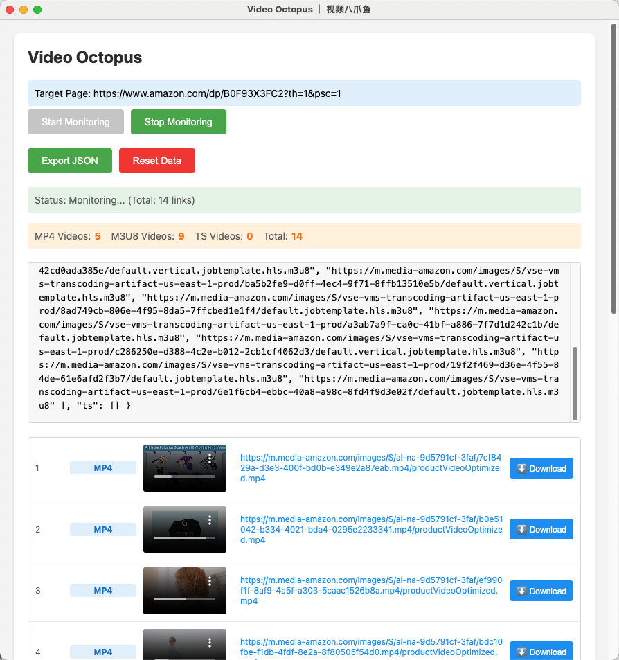

# OctoVideoSniffer

🦑 A powerful browser extension for **Chrome and Edge** that automatically **detects and extracts video links** (supports `.m3u8`, `.mp4`, `.ts`, and more) directly from any webpage.



---

## ✨ Key Features

* **🔍 Automatic Detection:** Intelligently identifies and extracts video resource links on web pages.
* **🧠 Multi-Format Support:** Compatible with major video formats including `.m3u8`, `.mp4`, `.ts`, and others.
* **📋 Clean & Simple UI:** Displays easily copyable video links in a straightforward interface.
* **🧩 Broad Compatibility:** Designed to work seamlessly with both Chrome and Edge browsers.
* **⚡ Lightweight & Fast:** Runs efficiently with zero configuration required, ready to use right after installation.

---

## 🚀 Installation Guide

### First-Time Installation Steps

1.  **Clone the Repository:**
    First, get the plugin's source code by cloning this repository to your local machine:
    ```bash
    git clone https://github.com/heyuan110/OctoVideoSniffer.git
    ```
    This will create a folder named `OctoVideoSniffer` containing the plugin files.

2.  **Open Browser Extensions Management Page:**
    In your Chrome or Edge browser's address bar, type the following address and press Enter:
    ```
    chrome://extensions/
    ```
    (If using Edge, you can also type `edge://extensions/`)

3.  **Enable "Developer mode":**
    On the extensions management page, find and **toggle on the "Developer mode" switch** located in the **top-right corner**.

4.  **Load Unpacked Extension:**
    Click the "**Load unpacked**" button that appears in the top-left corner of the page.

5.  **Select the Plugin Directory:**
    In the file selection window that pops up, **choose the `OctoVideoSniffer` folder** that you cloned in Step 1.

---

### 🚨 Important Note

During installation, your browser might display a warning such as "This extension is not from any known source" or similar. Please **confidently click "Keep" or "Enable"**. This is a standard security prompt issued by browsers for extensions installed outside of official app stores (like the Chrome Web Store). This plugin is **developed for internal company use**, has undergone internal security reviews, and is safe to use.
